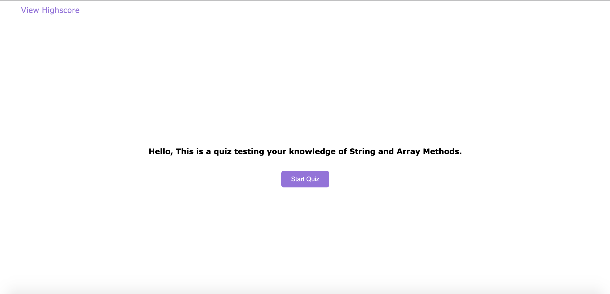

# Array and String Methods Code Quiz

## Description
This application is a quiz utilizing local storage to
save and sort the scores of each user in descending order.
The quiz is centered around string and srray Methods. When
a user anwsers a question incorrectly, time is subtracted
from the timer. When they anwser correctly, points are
added to the users score.

## Visuals

## Deployed Links

* [The URL of the deployed application.](https://simone188535.github.io/Array-and-String-Methods-Code-Quiz/)

* [The URL of the GitHub repository.](https://github.com/simone188535/Array-and-String-Methods-Code-Quiz)